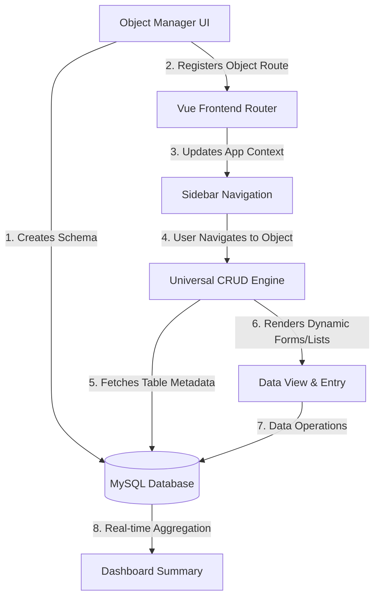

# 🚀 CRM Pro - Dynamic No-Code CRM Platform

A full-stack, dynamic Customer Relationship Management (CRM) platform inspired by enterprise solutions like Salesforce. Unlike standard applications with hardcoded tables, this project features an **Object Manager** that allows users to dynamically create database tables, define custom fields, and instantly generate CRUD (Create, Read, Update, Delete) interfaces without writing any additional code.

---

## 🏗️ Application Architecture & Flow

The core innovation of CRM Pro is its dynamic metadata-driven architecture. Here is the lifecycle of a custom object:



### Flow Breakdown:
1. **Schema Definition**: Through the **Object Manager**, users define the object name (e.g., `Projects`) and its fields (Text, Number, Date, Checkboxes, Enum Picklists).
2. **Dynamic Database Migration**: The Node.js server intercepts the request and safely executes `CREATE TABLE` and `ALTER TABLE` operations in MySQL on the fly.
3. **Dynamic Routing & UI Context**: The Vue.js frontend dynamically registers standard routes (`/view/:tableName`, `/detailview/:tableName/:id`) and triggers a state refresh to show the new module in the Sidebar.
4. **Universal Data Interaction**: A single, dynamic Vue component analyzes the incoming schema for the requested table and morphs its input controls appropriately, delivering full CRUD capabilities out of the box with built-in local search.

---

## ✨ Key Features

* **Dynamic Schema Builder (Object Manager):**
    * Create new custom objects (MySQL tables) directly from the UI.
    * Add custom fields (columns) on the fly, supporting Text, Number, Date, Checkboxes (Booleans), and Picklists (ENUMs).
* **Universal CRUD Engine:**
    * Forms automatically adapt their input types based on the dynamic schema definition.
    * Standardized list, detail, create, and update views for *any* custom object.
* **Automated Navigation:** Sidebar dynamically populates links to newly created modules.
* **Real-time Dashboard:** Summarized statistics (e.g., Total Leads, Pipeline Value) calculating metrics directly from the diverse database tables.
* **Modern UI:** Fully responsive and styled natively using standard Tailwind CSS utility classes.

---

## 🛠️ Tech Stack

### Frontend Architecture
* **Framework:** Vue 3 (Composition API)
* **Build Tool:** Vite
* **Routing:** Vue Router (Dynamic parameterized routing)
* **Styling:** Tailwind CSS V4
* **Networking:** Axios API Client

### Backend Architecture
* **Environment:** Node.js
* **Framework:** Express.js
* **Database:** MySQL (via `mysql2` driver)
* **Middleware:** CORS, Express JSON Parser, Dotenv configuration

---

## 📂 Project Structure

```text
crm-pro/
├── client/                     # Vue.js Frontend Application
│   ├── public/                 # Static assets
│   ├── src/
│   │   ├── assets/             # Global CSS and images mapping
│   │   ├── router/             # Parameterized UI routing definitions
│   │   ├── views/              # Pages:
│   │   │   ├── App.vue         # Main layout wrapper and dynamic sidebar engine
│   │   │   ├── Dashbord.vue    # Metrics summary viewer
│   │   │   ├── ObjectManager.vue # Database Table builder logic Core
│   │   │   ├── DynamicObj.vue  # Master Universal UI entry ListView
│   │   │   ├── AddItem.vue     # Dynamic form renderer for record insertions
│   │   │   └── UpdateItem.vue  # Dynamic form renderer for record alterations
│   └── package.json            # Client dependencies and Vite scripts
│
└── server/                     # Node.js Backend Application
    ├── config/                 # Connection pooling and DB environment initialization
    ├── routes/                 # Express sub-routers (Data IO, Schema execution)
    ├── server.js               # Application entry point & middleware bindings
    └── package.json            # Server dependencies
```

---

## ⚙️ Installation & Setup

### Prerequisites
* **Node.js**: v16.x or newer
* **MySQL**: v8.x installed and running.

### 1. Database Provisioning
Log into your MySQL instance and create the master database footprint:
```sql
CREATE DATABASE crm_db;
```
*(Operational Note: Specific domains like `leads` or `projects` do not need manual creation; rely completely on the Object Manager for schema generation!)*

### 2. Backend Environment (Node.js)
```bash
# Navigate to the API folder
cd server

# Install module dependencies
npm install

# Create required configuration descriptor
cp .env.example .env
```

**Configure `.env`**:
```env
PORT=3000
DB_HOST=localhost
DB_USER=root
DB_PASSWORD=your_mysql_password
DB_NAME=crm_db
```

**Init Server**:
```bash
npm run dev
```

### 3. Frontend Environment (Vue.js)
```bash
# Navigate to UI workspace
cd client

# Install Vue ecosystems and configurations
npm install

# Map environment variables
cp .env.example .env
```

**Configure `.env`**:
```env
VITE_API_BASE_URL=http://localhost:3000/api
```

**Init Vite Dev Server**:
```bash
npm run dev
```

---

## 🚀 Execution Guide 

1. **Dashboard Initialization:** Open a browser and navigate to `http://localhost:5173`.
2. **Schema Configuration:** Proceed to **Object Manager** exposed via the left-side navigation panel.
3. **Module Registration:** Create a new Object Entity (e.g., `Invoices` or `Contracts`).
4. **Data Typing:** Bind necessary field constraints (e.g., `Amount` as Number, `Status` as ENUM `['Sent', 'Paid', 'Overdue']`).
5. **Data Population:** Utilize the newly generated sidebar component links to interact and inject entries into your dynamic modules.

---

## 🗺️ Roadmap / Future Enhancements
* **Relational Lookup Architecture:** Implement foreign key references allowing custom objects to relate to parent standard entities (e.g., assign a 'Lead' dynamically to a specific 'Account').
* **Auth & Policy Enforcement:** Secure API operations via complete JSON Web Token (JWT) + standard Role-Based Access Control (RBAC) implementations.
* **Service-Level Pagination:** Optimize horizontal scaling features on standard API endpoints.
